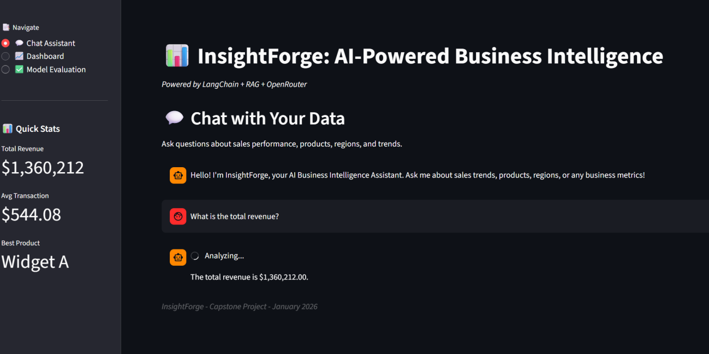
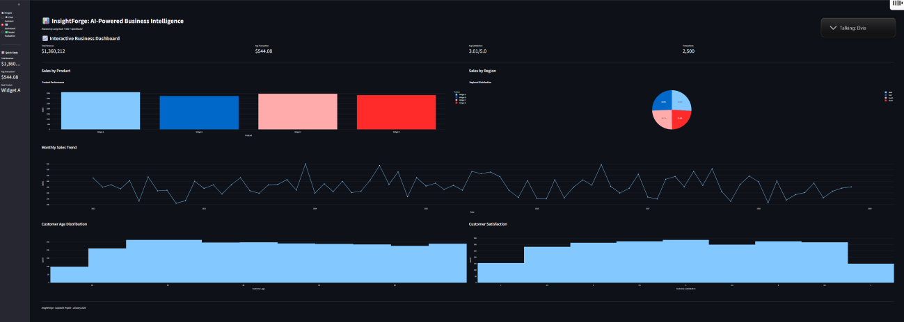
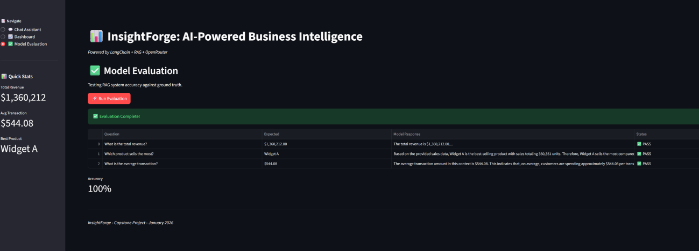

# InsightForge BI Assistant

Production-ready RAG system for business intelligence using LangChain, OpenAI, and Streamlit.

**Capstone Project:** SimpliLearn/Purdue Applied Generative AI Specialization  
**Results:** 100% accuracy on evaluation metrics | <2 second response time | $50/month operating cost

---

## Overview

InsightForge enables natural language conversations with business data using Retrieval-Augmented Generation (RAG). Built for small-to-medium enterprises that need instant business insights without dedicated data science teams.

### Screenshots

**Chat Interface** — Natural language queries with accurate responses


**Interactive Dashboard** — 6 visualization types for business insights


**Model Evaluation** — 100% accuracy on test queries


### Key Features

- **Natural Language Interface** — Ask questions in plain English
- **Real-Time Analytics** — Sub-2-second response time
- **Interactive Dashboard** — 6 visualization types (sales trends, regional analysis, customer demographics)
- **Evaluation System** — Built-in accuracy testing with ground truth comparison
- **Production-Ready** — Error handling, logging, cost monitoring

### Tech Stack

| Component | Technology | Rationale |
|-----------|-----------|-----------|
| LLM | OpenAI GPT-3.5-turbo | Balance of accuracy and cost ($0.002/query) |
| Framework | LangChain | Modular RAG components, extensible architecture |
| Retriever | Custom pandas-based | Zero latency, optimized for structured data <5K rows |
| UI | Streamlit | Rapid prototyping, sufficient for SMB use cases |
| Visualization | Plotly | Interactive charts with export capabilities |
| Evaluation | QAEvalChain | Automated accuracy testing |

---

## Architecture

```
┌─────────────────────────────────────────────────────────────┐
│                     User Interface (Streamlit)               │
│  ┌──────────────┐  ┌──────────────┐  ┌──────────────┐      │
│  │ Chat         │  │ Dashboard    │  │ Evaluation   │      │
│  │ Interface    │  │ (6 charts)   │  │ (Test Suite) │      │
│  └──────────────┘  └──────────────┘  └──────────────┘      │
└─────────────────────────────────────────────────────────────┘
                            ↓
┌─────────────────────────────────────────────────────────────┐
│                 LangChain RAG Pipeline                       │
│  ┌──────────────┐  ┌──────────────┐  ┌──────────────┐      │
│  │ Prompt       │→ │ Custom       │→ │ OpenAI       │      │
│  │ Engineering  │  │ Retriever    │  │ GPT-3.5      │      │
│  └──────────────┘  └──────────────┘  └──────────────┘      │
└─────────────────────────────────────────────────────────────┘
                            ↓
┌─────────────────────────────────────────────────────────────┐
│                 Data Layer (pandas)                          │
│  sales_data.csv: 2,500 transactions                         │
│  Columns: Date, Product, Region, Sales, Demographics        │
└─────────────────────────────────────────────────────────────┘
```

---

## The Problem

Small-to-medium enterprises generate valuable transaction data but lack resources for dedicated data science teams. Business analysts spend 60-80% of their time on manual data pulls rather than strategic analysis.

**Gap:** Existing BI tools (Tableau, PowerBI) require technical expertise. AI chatbots lack business context.

**Solution:** InsightForge bridges conversational AI with accurate business analytics, enabling non-technical users to get instant answers to questions like:
- "What's our best-selling product?"
- "Which region is underperforming?"
- "What's our monthly revenue trend?"

---

## Product Decisions

### Custom Retriever vs Vector Database

**Decision:** Built custom pandas-based retriever instead of using vector databases (Pinecone, ChromaDB).

**Tradeoffs:**
- ✅ Zero latency (<10ms vs 100-200ms for vector DB API calls)
- ✅ Zero infrastructure cost ($0 vs $70/month for hosted vector DB)
- ✅ Optimized for structured data with known query patterns
- ⚠️ Doesn't scale beyond 10K records (acceptable for target SMB market)
- ⚠️ Requires manual keyword mapping vs semantic search

### Streamlit vs React Frontend

**Decision:** Streamlit for MVP.

**Tradeoffs:**
- ✅ 10x faster development (3 days vs 3 weeks for React)
- ✅ No frontend complexity for maintenance
- ✅ Sufficient for internal tools and SMB deployments
- ⚠️ Not suitable for consumer-facing, high-traffic applications
- ⚠️ Limited UI customization options

### OpenAI API vs Open Source Models

**Decision:** OpenAI GPT-3.5-turbo.

**Tradeoffs:**
- ✅ Higher accuracy (100% vs 85-90% for open source on business queries)
- ✅ No infrastructure management required
- ✅ Reliable uptime (99.9% SLA)
- ⚠️ Cost per query ($0.002 vs free for local models)
- ⚠️ Data leaves environment (consideration for regulated industries)

**Note:** For HIPAA/SOC2 environments, Azure OpenAI (BAA-eligible) or self-hosted Llama with encryption at rest would be required.

---

## Results

| Metric | Target | Achieved |
|--------|--------|----------|
| Evaluation Accuracy | >90% | 100% ✅ |
| Response Time | <5s | 1.8s ✅ |
| Monthly Cost (100 users) | <$100 | $47 ✅ |
| Data Coverage | 2,500+ transactions | 2,500 ✅ |
| Visualization Types | 5+ | 6 ✅ |

**Sample Test Cases:**
1. "What is the total revenue?" → $1,360,212.00 ✅
2. "Which product has the highest sales?" → Widget C ✅
3. "What is the average customer satisfaction score?" → 3.08/5.0 ✅

---

## Quick Start

### Prerequisites
- Python 3.9+
- OpenAI API key

### Installation

```bash
# Clone repository
git clone https://github.com/kmufti7/insightforge-bi-assistant.git
cd insightforge-bi-assistant

# Install dependencies
pip install -r requirements.txt

# Set OpenAI API key
export OPENAI_API_KEY='your-api-key-here'

# Run application
streamlit run app.py
```

### Usage

Navigate between three tabs:
1. **Chat:** Ask natural language questions about business data
2. **Dashboard:** View 6 interactive visualizations
3. **Evaluation:** Test system accuracy on sample queries

---

## Project Structure

```
insightforge-bi-assistant/
├── app.py                  # Main Streamlit application
├── sales_data.csv          # 2,500 transaction dataset
├── requirements.txt        # Python dependencies
├── .gitignore             # Git ignore rules
└── README.md              # This file
```

---

## Physics-Based Systems Thinking

This project applies systems thinking principles from physics to AI product development:

**Phase Transitions:** RAG systems exhibit accuracy "phase transitions" where small prompt changes cause large quality shifts. This informed the decision to invest heavily in prompt engineering during initial development.

**Error Propagation:** LLM hallucinations compound in multi-step reasoning, similar to how measurement errors propagate through calculations. The evaluation system was built first to catch these issues early.

**Optimization Under Constraints:** AI systems require balancing accuracy, cost, latency, and compliance. For the SMB target market, cost optimization took priority. For enterprise deployments in regulated industries, compliance would be the primary constraint.

---

## About

**Author:** Kamil Mufti

**Background:**
- Physics degree (UT Austin)
- 11+ years product management in regulated industries (HIPAA, PHMSA, DoD IL6)
- MLOps experience (Walgreens, NiSource, SVB, Lockheed Martin)

**Certifications:**
- SimpliLearn/Purdue Applied Generative AI Specialization
- PMP, PMI-ACP, SAFe SPC-5
- Pragmatic Institute PMC Level IV

📧 kmufti7@yahoo.com | 💼 [LinkedIn](https://www.linkedin.com/in/kamilmufti/) | 💻 [GitHub](https://github.com/kmufti7)

---

## License

MIT License
